# CourseHub

## Team Members:
- Lea Ouslati
- Reem Antar
- Intissar Soulaiman
- Reem Nassif


## Assigned Topic:
We developed a Course Tutorial Management System to help manage tutorials, courses, and student progress.


### Primary Data Entities 
- **Users** – Represents all users of the system, including students and instructors. Each user has a unique ID, name, email, role, enrolled courses, created courses, progress in courses, and other profile information.

- **Courses** – Represents the different courses available in the system. Each course includes details like title, description, category, difficulty level, instructor, duration, rating, number of students, and associated modules.

- **Modules** – Each course is broken into modules. A module contains a set of lessons and has an order to define the learning sequence.

- **Lessons** – Represents the individual lessons within modules. Each lesson includes a title, content description, duration, and a video URL for learning purposes.


## Deployed Application

- **Frontend (Vercel):** https://course-tutorialmanagementsystem.vercel.app
- **Backend API (Render):** https://course-tutorialmanagementsystem.onrender.com
- **API Health Check:** https://course-tutorialmanagementsystem.onrender.com/api/health
- **Interactive API Docs (Swagger):** https://course-tutorialmanagementsystem.onrender.com/api/docs

## Setup Instructions for Running Frontend Locally

1. **Clone the repository:**
   ```bash
   git clone https://github.com/leaouslati/course-tutorialmanagementsystem.git
   cd course-tutorial-system
   ```

2. **Install dependencies:**
   ```bash
   npm install
   ```

3. **Start the development server:**
   ```bash
   npm run dev
   ```

4. **Open your browser and go to:**
   ```
   http://localhost:5173
   ```

**Requirements:**
- Node.js (v16 or higher recommended)


## Setup Instructions for Running the Backend Locally (Phase 2)

1. **Navigate to the backend folder:**
   ```bash
   cd course-tutorial-system/backend
   ```

2. **Install dependencies:**
   ```bash
   npm install
   ```

3. **Create a `.env` file** inside the `backend/` folder:
   ```env
   DATABASE_URL=your_postgresql_connection_string
   JWT_SECRET=your_secret_key_here
   PORT=3000
   ```

4. **Start the backend server:**
   ```bash
   npm run dev
   ```

5. **The API will be available at:** `http://localhost:3000`
   Interactive API docs: `http://localhost:3000/api/docs`

> **Note:** For local full-stack development, also create a `frontend/.env.local` file with:
> ```env
> VITE_API_URL=http://localhost:3000/api
> ```


## Screenshots of Important Features

### Homepage in Light Mode


### Homepage in Dark Mode


### Course page filtering searching and checking courses
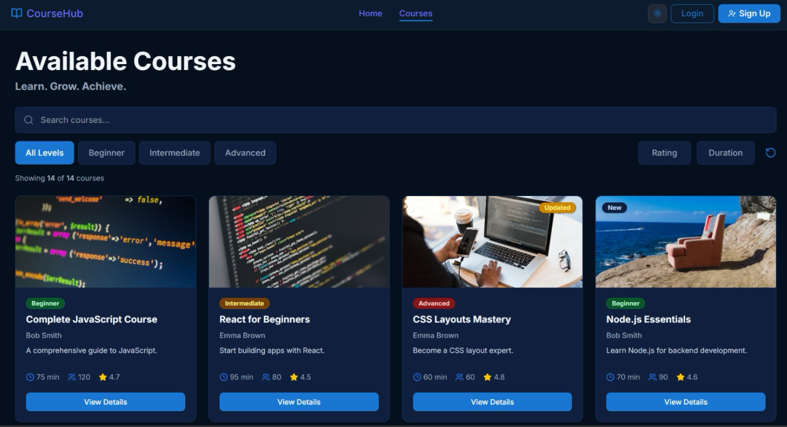

### Enrollments page
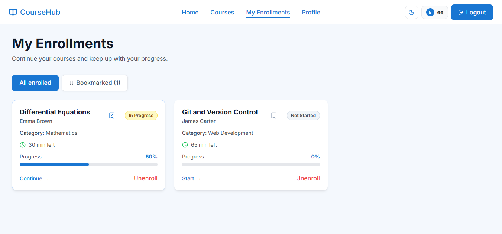

### Profile page
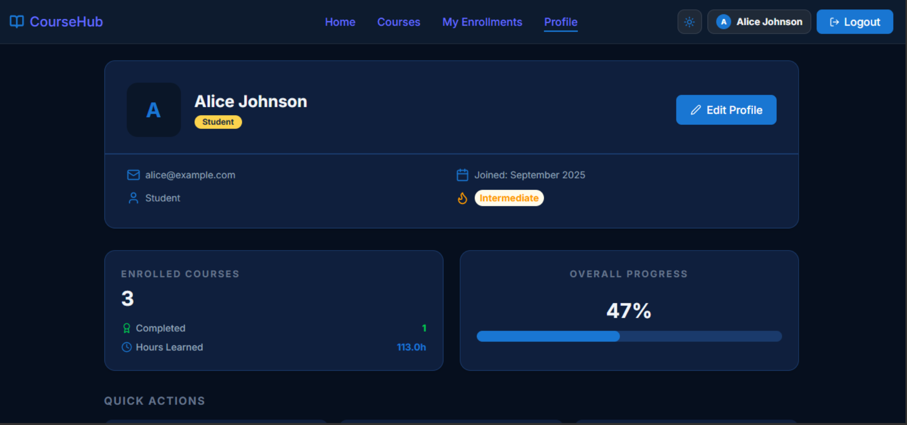

### Navbar before logging in 


### Navbar after logging in


### Login Page
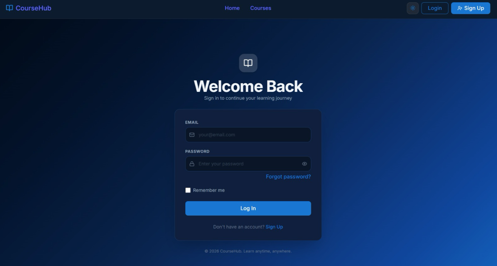

### Sign-up Page
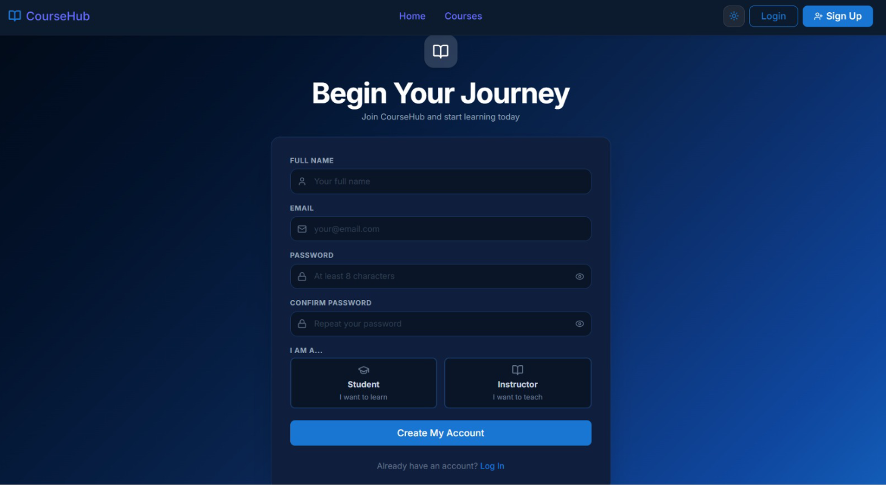

### Manage Courses Page
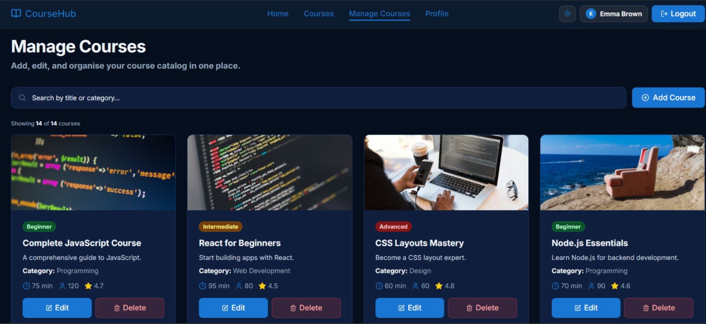

### Course Details Page
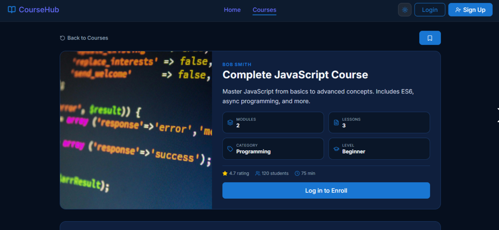

### Bookmark Filtering (Enrollments Page)
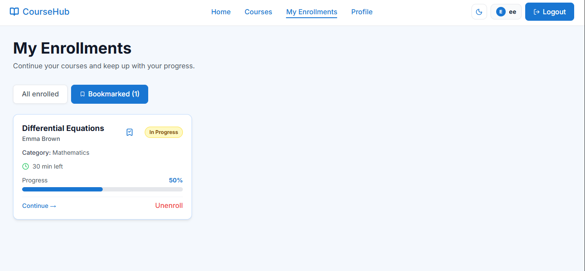

### Unenroll Confirmation
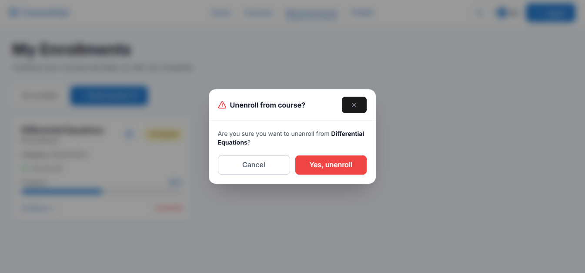

### Badges and Actions Profile


### Edit Profile Info
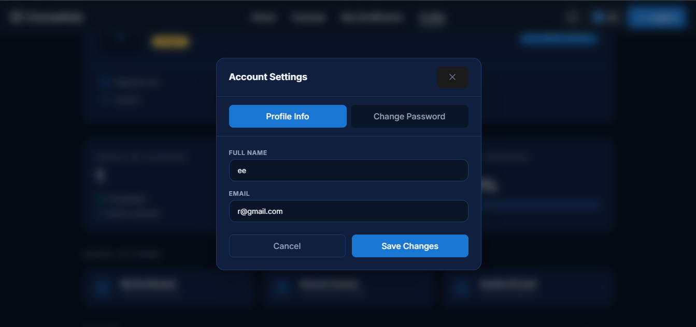

### Edit Profile Password
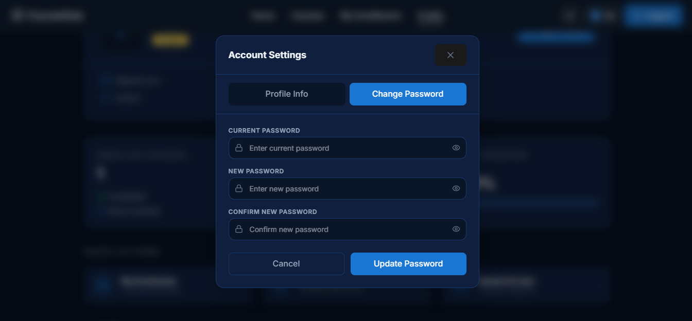

### Instructor Profile
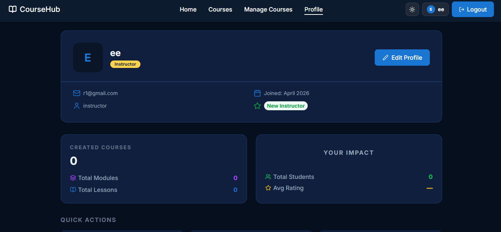

### Manage Courses Before ADD


### After Adding Courses


### Delete Course Instructor


### Add Modules-Manage Courses Page


### ADD Lessons


### Delete Module Confirmation


### Delete Lesson Confirmation


## Team Member Contributions

### Member 1: Lea Ouslati
- Responsible for: Homepage & Login Page

-  **Phase 1 Contributions:**
    - Set up React Router to manage navigation between different pages of the application.

    - Designed and implemented the Homepage, including layout structure, featured courses section,   navigation links, and key platform statistics.

    - Developed the Login Page with form validation and integration with mock user data.

    - Implemented user authentication logic on the Login Page, including input validation, error handling, and redirecting users to the Homepage after successful login.
    
    - Managed and organized the GitHub repository, including creating branches, handling commits, and merging changes when needed to maintain a clean workflow.

- **Phase 2 Contributions:**
    - Architected the entire Node.js/Express backend with a clean routes → controllers → database pattern.

    - Implemented JWT-based authentication (register, login, forgot-password) with bcrypt password hashing.

    - Set up all Express middleware: JSON parsing, request logger, error handler, authMiddleware, and instructorOnly guard.

    - Wrote the complete OpenAPI 3.0 Swagger specification and mounted interactive docs at `/api/docs`.

    - Full backend architecture, JWT authentication, Express middleware, Swagger API documentation, and API integration across Home, AuthContext, ProtectedRoute, and App.jsx 

### Member 2: Reem Antar 
- Responsible for: CourseCard, CourseDetails, and Courses pages

- **Phase 1 Contributions:**

   - Built the CourseCard component to showcase courses with key info like title, instructor, difficulty, duration, and ratings, including dynamic badges for new or recently updated courses.

   - Designed the CourseDetails page, allowing users to explore full course info, view modules and lessons, enroll in courses, and receive real-time notifications for actions.

   - Created the Courses page with search, filters, and sorting options. 

   - Filtering and searching include: users can filter by difficulty or category, search by course title, and sort by rating or duration making it simple to quickly find the course that fits their needs.

   - Defined and structured the modules dataset in mockdata.js

   - Chose the color palette and styling rules for these pages, ensuring a consistent and user-friendly interface across the website

- **Phase 2 Contributions:**

   - Worked on integrating the frontend pages with the real backend API, replacing all mockdata logic with real database calls.

   - Participated in designing and implementing the database interaction layer, writing SQL queries to fetch, filter, and update data from the PostgreSQL database hosted on Supabase.

   - Contributed to error handling across the application, ensuring consistent responses and meaningful error messages for different failure cases.

   - Participated in testing the application end-to-end, identifying bugs and verifying fixes across different user flows.
   
   - Backend courses routes, enrollment status endpoint, modules controller, loading/error/toast components, and CourseCard API integration


### Member 3: Intissar Soulaiman
- Responsible for: Navbar, Profile Page, and Enrollments Page.

- **Phase 1 Contributions:**

   - Built the Navbar component and organized it inside the components folder, including the navigation menu, page links, and theme toggle button. Also updated it so the Enrollments link only appears when the student is logged in, and Manage Courses when the instructor is logged in .
  
   - Designed and implemented the Profile Page with user information, quick actions, badges, ID card modal, and edit profile modal. Added responsive layouts so the page works well on mobile, tablet, and desktop screens.
     
   - Developed the Enrollments Page to display each student’s enrolled courses with progress bars, course status, module and lesson counts, and continue actions. Also added unenroll confirmation handling and responsive card layouts
     
   - Expanded and structured the mock data in mockdata.js by adding more courses, users, lessons, and modules, with different progress values to make testing more realistic and to support dynamic rendering across the app.
     
   - Continuously tested the pages during development to make sure the layouts, navigation, and course data were working correctly.

- **Phase 2 Contributions:**

 - Wrote the users controller handling profile retrieval and updates including secure password changes with bcrypt verification.

   - Implemented the auth middleware for JWT verification on protected routes and the instructorOnly guard for instructor-restricted endpoints.

   - Built the lessons controller and delete endpoints for both modules and lessons with ownership verification.

   - Rewired Profile, Navbar, and CourseDetails pages to use real API data replacing all mockdata logic with live database calls.

   - Participated in testing the application and verifying fixes across auth, profile, and enrollment flows.

### Member 4: Reem Nassif
- Responsible for: Register Page & Manage Courses Page

- **Phase 1 Contributions:**

   - Designed and implemented the user registration form with input validation and role selection.
     
   - Integrated authentication logic with automatic login and navigation after successful registration
     
   - Developed the Manage Courses page with full CRUD functionality (add, edit, delete courses)
     
   - Implemented search and dynamic updates to manage courses efficiently within the interface.
     
   - Integrated advanced features such as user authentication, role management, and dynamic course handling.

- **Phase 2 Contributions:**

 - Wrote the auth routes wiring register, login, and forgot-password endpoints to their controllers.

   - Implemented enrollment routes for all four enrollment actions behind authentication middleware.

   - Built PUT endpoints for modules and lessons allowing partial updates with only the fields provided.

   - Standardized all validation error responses across the codebase to use a consistent format.

   - Rewired Register, ManageCourses, Home, and ModuleAccordion to use real API data replacing all mockdata logic with live database calls.

## Mock Data Explanation: Used Only for Phase 1
- Mock data is used to simulate user login and determine whether the user is a student or instructor.
  
- It allows dynamic display of courses, modules, and lessons across different pages.
  
- User progress and enrollments are updated using mock data to simulate real learning interactions.
  
- Course data enables searching, filtering, and navigation without a backend.
  
- Manage Courses uses mock data to simulate adding, editing, and deleting courses.
  
- All interactions are handled locally in mockdata.js to mimic a real course management system during development and testing.


## API Documentation (Phase 2)

> **Base URL:** `https://course-tutorialmanagementsystem.onrender.com/api`
> All request and response bodies use JSON. Protected routes require the header `Authorization: Bearer <token>`.

### Authentication — `/api/auth`

| Method | Endpoint | Auth | Description |
|---|---|---|---|
| POST | `/auth/register` | No | Register a new user (student or instructor) |
| POST | `/auth/login` | No | Log in and receive a JWT |
| POST | `/auth/check-email` | No | Check if an email is already registered |
| POST | `/auth/forgot-password` | No | Verify the account exists before resetting the password |
| POST | `/auth/reset-password` | No | Reset the password using the verified email + new password |

**Register request body:**
```json
{ "name": "Jane Doe", "email": "jane@example.com", "password": "mypassword123", "role": "student" }
```
**Login request body:**
```json
{ "email": "jane@example.com", "password": "mypassword123" }
```
**Both respond with:**
```json
{ "token": "<jwt>", "user": { "id": "uuid", "name": "Jane Doe", "email": "jane@example.com", "role": "student" } }
```

---

### Courses — `/api/courses`

| Method | Endpoint | Auth | Description |
|---|---|---|---|
| GET | `/courses` | No | List all courses (supports `?search=`, `?category=`, `?difficulty=`, `?instructorId=me`, `?sortRating=asc\|desc`, `?sortTime=asc\|desc`) |
| GET | `/courses/stats` | No | Get platform totals: total courses, total students, average rating |
| GET | `/courses/:id` | No | Get a single course with its full module and lesson tree |
| POST | `/courses` | Yes (instructor) | Create a new course |
| PUT | `/courses/:id` | Yes (owner) | Update course fields |
| DELETE | `/courses/:id` | Yes (owner) | Delete a course and all its modules and lessons |

**Create/update request body:**
```json
{ "title": "...", "shortDescription": "...", "description": "...", "category": "Programming", "difficulty": "Beginner", "duration": 120, "image": "https://..." }
```

---

### Modules — `/api/modules`

| Method | Endpoint | Auth | Description |
|---|---|---|---|
| POST | `/modules` | Yes (instructor) | Add a module to a course |
| PUT | `/modules/:id` | Yes (owner) | Update a module's title |
| DELETE | `/modules/:id` | Yes (owner) | Delete a module and all its lessons |

**Create request body:** `{ "courseId": "uuid", "title": "Module Title" }`
**Update request body:** `{ "title": "New Title" }`

---

### Lessons — `/api/lessons`

| Method | Endpoint | Auth | Description |
|---|---|---|---|
| POST | `/lessons` | Yes (instructor) | Add a lesson to a module |
| PUT | `/lessons/:id` | Yes (owner) | Update lesson fields (any subset) |
| DELETE | `/lessons/:id` | Yes (owner) | Delete a lesson |

**Create request body:**
```json
{ "moduleId": "uuid", "title": "Lesson Title", "content": "...", "duration": 15, "videoUrl": "https://..." }
```

---

### Enrollments — `/api/enrollments`

| Method | Endpoint | Auth | Description |
|---|---|---|---|
| GET | `/enrollments` | Yes | List all courses the logged-in student is enrolled in |
| GET | `/enrollments/:courseId/status` | Yes | Check if the user is enrolled in a specific course |
| POST | `/enrollments` | Yes (student) | Enroll in a course |
| DELETE | `/enrollments/:courseId` | Yes | Remove enrollment from a course |
| PUT | `/enrollments/:courseId/progress` | Yes | Update progress percentage (0–100) |

**Enroll request body:** `{ "courseId": "uuid" }`
**Progress request body:** `{ "progress": 75 }`

---

### Users — `/api/users`

| Method | Endpoint | Auth | Description |
|---|---|---|---|
| GET | `/users/me` | Yes | Get the authenticated user's profile |
| PUT | `/users/me` | Yes | Update name, email, or password |

**Update request body:**
```json
{ "name": "New Name", "email": "new@email.com", "currentPassword": "old123", "newPassword": "new456" }
```
> `currentPassword` is only required when changing the password.

---

## Technical Challenges (Phase 2)

### 1. Ownership Verification for Nested Resources
Modules and lessons do not store an `instructor_id` directly. To verify ownership before allowing any edit or delete, the backend walks the chain: lesson → module → course → instructor. Each controller performs sequential database queries and returns 403 if the caller is not the course owner.


### 2. Migrating from Mockdata to a Live Database
The entire frontend was originally built on static mockdata with hardcoded IDs like `u1`, `c1`, and `m1`. When the real database was introduced, all IDs became UUIDs and all relationships had to be re-established. Every page had to be rewritten to fetch from the API, handle loading and error states, and manage asynchronous data instead of synchronous imports. 

### 3. JWT Authentication Across Frontend and Backend
Implementing a stateless authentication system required careful coordination between the frontend and backend. The backend signs a JWT on login containing the user's ID and role, while the frontend stores it in localStorage and attaches it to every protected request via the authFetch helper. Handling edge cases such as expired tokens, missing tokens on protected pages, and role-based access restrictions required updates across the AuthContext, ProtectedRoute, RoleRoute, and every page that makes authenticated API calls.